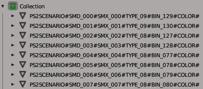

# RE4-PS2-SCENARIO-SMD-TOOL

Extract and repack RE4 PS2 scenario smd file

Translate from Portuguese Brazil

Programa destinado a extrair e recompactar os cenários usando somente um arquivo .OBJ;

**Update: B.1.2.0.1**
 Corrigido bug que crashava o programa, agora, ao ter material sem a textura principal "map_Kd", será preenchido o Id da textura como 0000; 

## Update B.1.2.0.0

Nessa atualização, eu refiz a tool, agora é somente um único executável. O funcionamento dessa tool é parecido com a tool de scenario do UHD, só que essa é para a versão de PS2.
  Os arquivos da versão anterior NÃO são compatíveis com essa versão;

## RE4_PS2_SCENARIO_SMD_TOOL.exe

Programa destinado a extrair e reempacotar os arquivos de cenario .SMD do re4 PS2;

## Extract:

Use o bat: "RE4_PS2_SCENARIO_SMD_TOOL Extract all scenario SMD.bat"
 Nesse exemplo vou usar o arquivo: r100_004.SMD
 Ao extrair será gerado os arquivos:

* r100_004.scenario.idxps2scenario  // arquivo importante de configurações, para o repack usando o .obj;
* r100_004.scenario.idxps2smd //  arquivo importante de configurações, para o repack usando os arquivos .bin;
* r100_004.scenario.obj // conteúdo de todo o cenário, esse é o arquivo que você vai editar;
* r100_004.scenario.mtl // arquivo que acompanha o .obj;
* r100_004.scenario.idxmaterial // conteúdo dos materiais (alternativa ao uso do .mtl);
* r100_004.TPL // esse é o arquivo TPL que esta dentro do SMD, é onde ficam as texturas dos modelos;
* r100_004_BIN\ // pasta contendo os arquivos .bin;
* r100_004.scenario.DrawDistance.obj // arquivo informacional, mas não é utilizado no repack.
* r100_004.scenario.reference.smd // arquivo informacional, mas não é utilizado no repack.

## Repack:

Existem duas maneiras de fazer o repack.

* Usando o arquivo .idxps2scenario, o repack será feito usando o arquivo .obj;
* Usando o arquivo .idxps2smd, o repack será feito com os arquivos .bin da pasta "r100_004_BIN";

## Repack com .idxps2scenario

Use o bat: "RE4_PS2_SCENARIO_SMD_TOOL Repack all with idxps2scenario.bat"
 Nesse exemplo vou usar o arquivo: "r100_004.scenario.idxuhdscenario"
  que vai requisitar também os arquivos:
* r100_004.scenario.obj (obrigatório);
* r100_004.TPL (obrigatório);
* r100_004.scenario.mtl OU r100_004.scenario.idxmaterial;

Ao fazer o repack será gerado os arquivos:
* r100_004.SMD (esse é o arquivo para ser colocado no r100.dat);
* r100_004.scenario.Repack.idxmaterial
* r100_004.scenario.Repack.idxps2smd
* r100_004.scenario.Repack.reference.smd
* r100_004_BIN\ //pasta contendo os novos arquivos .BIN; (aviso: ele sobrescreve os arquivos);

## Repack com .idxps2smd

Use o bat: "RE4_PS2_SCENARIO_SMD_TOOL Repack all with idxps2smd.bat"
 Nesse exemplo vou usar o arquivo: "r100_004.scenario.idxps2smd"
  Que vai requisitar os arquivos:
 -- os arquivos .BIN da pasta "r100_004_BIN";
 -- e o arquivo TPL de nome "r100_004.TPL";

Ao fazer o repack será gerado os arquivos:
 -- r100_004.SMD (esse é o arquivo para ser colocado no r100.dat);

Nota: esse é o método antigo, no qual se edita os bin individualmente, porem o repack com .idxps2scenario cria novos bin modificados, e um novo .idxps2smd, no qual pode ser usado para fazer esse repack; essa opção é para caso você queira colocar um .bin no .smd que o programa não consiga criar.

## Sobre r100_004.scenario.obj
Esse arquivo é onde está todo o cenário, nele os arquivos BIN são separados por grupos, no qual é nomenclatura deve ser respeitada:
  Exemplo:
  PS2SCENARIO#SMD_000#SMX_000#TYPE_09#BIN_129#COLOR#
  PS2SCENARIO#SMD_077#SMX_060#TYPE_8C#BIN_140#NORMAL#

Sendo:
* É obrigatório o nome do grupo começar com "PS2SCENARIO", e ser divido por #
* A ordem dos campos não pode ser mudada;
* SMD_000 esse é o ID do da posição da Entry/Line no .SMD, a numeração é em decimal
* SMX_000 esse é o ID do SMX, veja o arquivo .SMX,  a numeração é em decimal
* TYPE_08 esse não sei oque é, a numeração é em hexadecimal.
* BIN_000 esse é o id do bin que será usado, para bin repetidos, será considerado somente o primeiro, (o próximo com o mesmo id, será usado o mesmo modelo que do primeiro).
* COLOR/NORMAL esse texto define o tipo de BIN, sendo:
 + COLOR: o BIN não vai ter as normals, mas vai ter cor por vértices;
 + NORMAL: o BIN vai ter as normals, e não terá cor por vértices (esse tipo ocupa mais espaço, pois também tem suporte a pesos por Bone);
* o nome do grupo deve terminar com # (pois, após salvo o arquivo, o Blender coloca mais texto no final do nome do grupo);

----> Caso use outro editor (3dsMax), o nome dos objetos/grupos também pode ser:
  PS2SCENARIO\_SMD\_000\_SMX\_000\_TYPE\_09\_BIN\_129\_COLOR\_
  PS2SCENARIO\_SMD\_077\_SMX\_060\_TYPE\_8C\_BIN\_140\_NORMAL\_

----> Sobre verificações de grupos:
  * No Repack se ao lado direito do nome do grupo aparecer o texto "The group name is wrong;", significa que o nome do grupo está errado, e o seu arquivo SMD vai ficar errado;
  * E se ao lado direito aparecer "Warning: Group not used;" esse grupo esta sendo ignorado pelo meu programa, caso, na verdade, você gostaria de usá-lo, você deve arrumar o nome do grupo;

**Editando o arquivo .obj no Blender**
 No importador de .obj marque a caixa "Split By Group" que está no lado direito da tela.
 Com o arquivo importado, cada objeto representa um arquivo .BIN
 
 Nota: caso você tenha problema com texturas transparentes ficando pretas, use esse plugin: (**[link](https://github.com/JADERLINK/Blender_Transparency_Fix_Plugin)**) 

**Ao salvar o arquivo**
 Marque as caixas "Triangulated Mesh" e "Object Groups" e "Colors".
  no arquivo .obj o nome dos grupos vai ficar com "_Mesh" no final do nome (por isso, no editor, termina o nome do grupo com # para evitar problemas);

## Sobre .idxps2scenario / .idxps2smd
 Segue a baixo a lista de comando mais importantes presente no arquivo:

* SmdAmount:283 // representa a quantidade de Entry/Line no .Smd (você pode mudar, mas em alguns cenário pode esta crashando o jogo)
* SmdFileName:r100_004.SMD // esse é o nome do arquivo Smd que será gerado
* TplFile:r100_004.TPL // esse é o nome do arquivo TPL que sera colocado dentro do SMD;
* BinFolder:r100_004_BIN // esse é o nome da pasta onde sara salvo/esta os arquivos .BIN;
UseIdxMaterial:false // caso ativado será o usado o arquivo .idxmaterial ao invés do .mtl para fazer o repack (campo somente no idxps2scenario);
BinAmount:148 // quantidade de arquivos bins que serão colocados no .smd (campo somente no idxps2smd);
* Os outros comandos que começam com números são auto descritivos (o número é o ID do Smd)
* o campo "_position*" é divido por 100, em relação ao valor original;
* o campo "_objectStatus" refere-se o campo "TYPE" no .obj;

 ## Materials/Texturas no MTL

Agora, é no arquivo MTL é onde são definidos quais são os IDs (índices do TPL) das texturas usadas no arquivo BIN;
 Agora, o nome da textura tem que ser somente um número que é o ID da textura;
 O arquivo MTL espera que essas texturas estejam em uma pasta como o mesmo nome do arquivo BIN que foi extraído;
 Para o extrair as texturas do arquivo TPL use o programa [RE4-PS2-TPL-TOOL](https://github.com/JADERLINK/RE4-PS2-TPL-TOOL) a partir da versão B.1.1.0.0;
  Use o Bat: "RE4_PS2_TPL_EXTRACT_To_Scenario_TPL.bat", para extrair as texturas corretamente;
  Atenção: lembre de fazer o repack do TPL antes de fazer o repack do SMD;

## DrawDistance
Caso o seu modelo fique muito longe da posição original, ele pode começar a aparecer e desaparecer, isso é devido aos valores que definem a que distância os modelos iram ser vistos.
  Mude os valores de "xxx_DrawDistanceNegative*" para -327670
  E os valores de "xxx_DrawDistancePositive*:" para 655340
  Isso vai garantir que o modelo fique visível, porém pode gerar um bug na iluminação.

## Bugs e Infos
Ao mudar os valores originais dos campos "xxx_scale*", "xxx_angle*", "xxx_position*", "xxx_DrawDistanceNegative*" e "xxx_DrawDistancePositive*", pode ocasionar um bug na iluminação do modelo, no qual não sei como resolver.
  Nota: O programa muda o valor de "xxx_position*" automaticamente, pois tenho que centralizar os arquivos BIN, então todas as SMD entry com BIN repetidos, você vai ter que recalcular a posição do objeto;
  As novas posições ficam no arquivo "r100_004.scenario.Repack.idxps2smd";

## Código de terceiro:

[ObjLoader by chrisjansson](https://github.com/chrisjansson/ObjLoader):
Encontra-se no RE4_PS2_SCENARIO_SMD_TOOL, código modificado, as modificações podem ser vistas aqui: [link](https://github.com/JADERLINK/ObjLoader).

**At.te: JADERLINK**
 2024-01-20